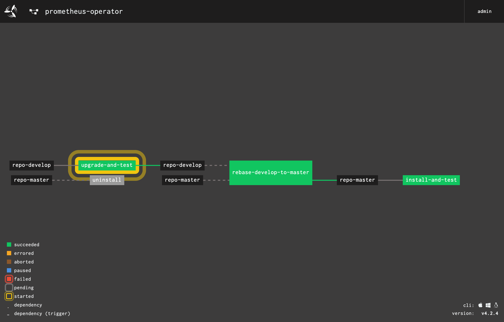

# Prometheus Operator Helm Chart Deployment

Deploys [Prometheus Operator](https://github.com/coreos/prometheus-operator) using the [Helm Chart](https://github.com/helm/charts/tree/master/stable/prometheus-operator).

## Setup

1. Create a network profile (Only applicable for NSX-T)

```bash
export TEMP_DIR=$(mktemp -d)
cat > "${TEMP_DIR}/network-profile-medium.json" <<EOF
{
  "description": "network profile with medium size LB",
  "name": "network-profile-medium",
  "parameters": {
    "lb_size": "medium"
  }
}
EOF
```

```bash
pks create-network-profile "${TEMP_DIR}/network-profile-medium.json"
```

1. Create 3 clusters

```bash
for i in $(seq 3); do
    pks create-cluster "cluster0$i" --num-nodes 1 \
        --external-hostname "cluster0$i.$EXTERNAL_HOSTNAME" \
        --plan small-Istio --network-profile network-profile-medium --non-interactive
done
```

## Install / Uninstall

### Install Operator

Install operator into a single cluster

```bash
./install.sh
```

Install operator into all clusters

```bash
./install-all.sh
```

### Uninstall Operator

Uninstall operator from a single cluster

```bash
./uninstall.sh
```

Uninstall operator from all clusters

```bash
./uninstall-all.sh
```

## Upgrade

To upgrade a Helm Chart you'll want to find the version of the Chart you've installed already and check to see if the `version` and `appVersion` values have changed.

The version of the Chart as well as the application it deploys is contained in the `Chart.yaml` located at the root of the [chart directory](./charts/prometheus-operator/Chart.yaml). These two versions: `version` and `appVersion`, correspond to the version of the Prometheus Helm Chart and Prometheus Operator, respectively. You'll find the latest releases of the Prometheus Operator Helm Chart [here](https://hub.helm.sh/charts/stable/prometheus-operator) and the latest releases of the Prometheus Operator [here](https://github.com/coreos/prometheus-operator/releases). You can also get the current chart details by running `helm show` or `helm inspect`.

The Operator version is always going to be behind the Chart version. A lot of work goes into maintaining the Prometheus Helm Chart, so you'll notice that there are many versions for the Chart without any changes to the Operator version.

We've created a script to make it easier to upgrade the chart. Run the following script to upgrade the chart to version `8.5.2`:

```bash
./upgrade-chart.sh 8.5.2
```

This will download a tarball of version `8.5.2` of the Chart and untar it into the local `./charts` directory, overwriting what is in that directory.

### Incremental changes

After installation, you may find yourself needing to make updates to the Prometheus Operator or Helm configuration. Similar to installing the chart, customizations are made in the form of overrides via the `--values` or `--set` options. However, instead of `helm install`, you'll use `helm upgrade`.

It's important that you make your updates using the `helm upgrade` command instead of using `kubectl` or manually editing chart resources. This is to ensure that all resources are updated appropriately.

The install script runs `helm upgrade -i` where the `-i` tells helm to install the chart if it doesn't exist.

The script will issue a command like this:

```bash
helm upgrade -i --version "${version}" "${release}" \
    --namespace "${namespace}" \
    --values /tmp/overrides.yaml \
    ./charts/prometheus-operator
```

where `${version}` is the version of the chart that you want to upgrade to, and `${release}` is the name of the release that is managing the instance of the Operator that you are trying to upgrade. Although, not strictly necessary, the `--version` flag is useful for when the chart is maintained in a central Helm Chart Repository and not referenced from a local directory. In our case, the chart is located inside this git repository so the `--version` flag doesn't have any effect.

## Pipeline

The [Concourse](https://concourse-ci.org/) CI [pipeline](./ci/pipeline.yml) runs lint, installs or upgrades the Prometheus Operator including the [bosh-exporter](./charts/prometheus-operator/charts/bosh-exporter) and [pks-monitor](./charts/prometheus-operator/charts/pks-monitor) and runs helm tests on each deployment. The upgrade pulls the latest code from `develop` and gets the latest version of the chart, then upgrades the deployment on a single cluster. If that passes all the checks, then we merge into master and the upgrade runs on all the clusters.



To create the pipeline run:

```bash
./ci/set-pipeline.sh
```

You'll need to create a [creds.yml](./ci/creds.yml.sample) file before you run this script.

__N.B.__ When you set your pipeline parameters, you should pick a cluster for the `upgrade-chart` job that is reserved for upgrades only. Consider this as a canary cluster. Don't use a cluster that you are already using for the `install` job. Eventually, the pipeline will either create a cluster or a new namespace to avoid these possible collisions. For example, I reserve one of my clusters for the `upgrade-chart` job and if that passes then the pipeline will run through the rest of the clusters. The `upgrade-chart` job runs all the same tasks as the `install` pipeline but with an additional step to grab the latest chart version beforehand. If that cluster upgrades and passes all the tests, then I rebase `master` from `develop` and that kicks off the pipeline again to upgrade the remaining clusters. Remember, because the `install` job is running a `helm upgrade -i`, it will upgrade unless there isn't an existing deployment already running in the specified namespace.

## Performing Blue/Green

TBD: How are we going to do blue/green deployments?

1. Deploy multiple replicas of Prometheus
2. Prometheus is deployed into multiple clusters... Do a canary upgrade to each Prometheus across the foundation

## Development

TODO

### Get latest helm chart dependencies

To find all images used by the prometheus-operator helm chart run `find-images.py`. This is a python script with local dependencies use `venv` as follows

```bash
source .venv/bin/activate
```

Then run the script

```bash
./find-images.py
```
